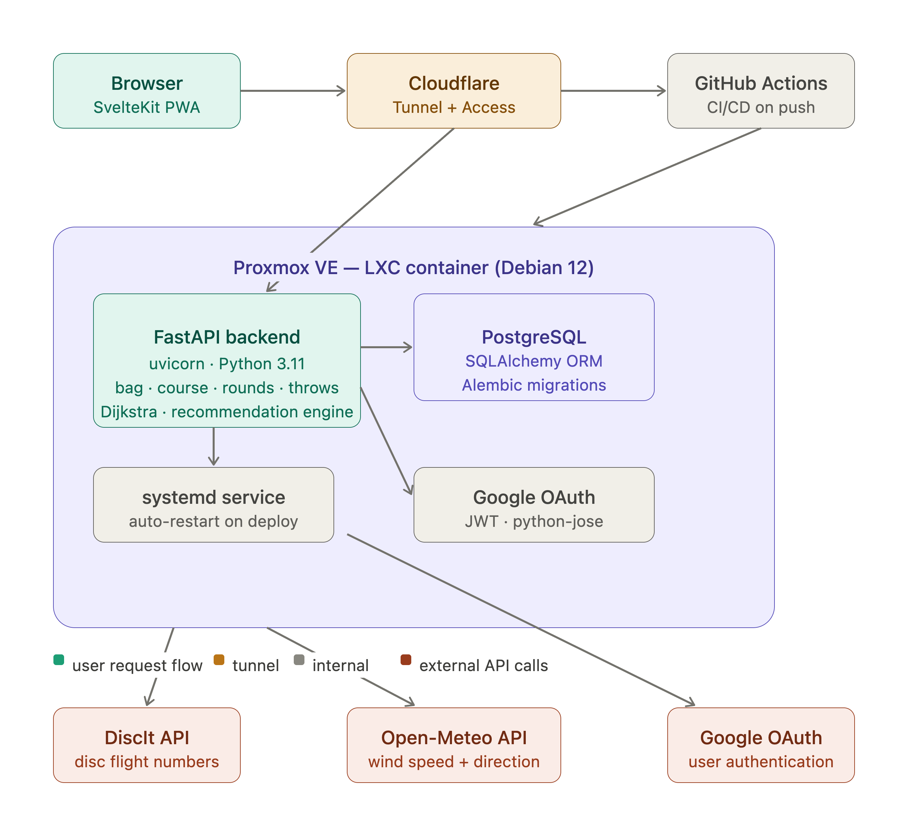

# HyzerPath

HyzerPath is an intelligent disc golf caddie. It models each hole as a directed graph of nodes and edges, runs Dijkstra's algorithm to find the optimal path from tee to basket, and recommends specific discs from the player's bag for each throw segment based on their personal measured throw distances. It is live at [hp.rmccue.dev](https://hp.rmccue.dev).

## Tech stack

**Backend**
- Python, FastAPI
- PostgreSQL, SQLAlchemy, Alembic
- Google OAuth, JWT auth

**Frontend**
- SvelteKit 2, Svelte 5, TypeScript
- Tailwind CSS v4
- MapLibre GL, PWA

**Infrastructure**
- nginx, Cloudflare Tunnel
- Self-hosted LXC container, CI/CD via GitHub Actions

## How it works

Each hole is stored as a directed graph. Nodes are points on the hole (tee, fairway landing zones, doglegs, basket), each with a GPS coordinate. Edges connect nodes reachable in a single throw and carry a distance plus any hazards along them. A course editor places nodes on a satellite map, and edges are rebuilt as a chain from tee to basket so a route follows the real fairway instead of cutting across out of bounds.

To plan a hole, the engine runs Dijkstra from the tee node to the basket node. Edge weight is not raw distance, it is an estimate of throws plus penalties: an edge longer than the player's measured reach costs proportionally more than one throw, lateral distance from the fairway centerline adds a penalty scaled by fairway width, and each hazard adds a cost that varies by play mode (conservative, balanced, aggressive). The result is the lowest-cost route the player can actually execute, not just the shortest line.

Once the path is found, a lookahead pass merges nodes into single throws the player can cover, respecting per-mode tolerance for cutting corners and crossing hazards. For each segment the engine scores every disc against the required distance and the shape the corridor demands, evaluating both backhand and forehand using the player's separately measured distance for each style. It returns a disc, a throw style, and a shape (hyzer, anhyzer, flex) per throw.

Throw distances come from the player. A field measuring mode records GPS start and end points per throw, tagged backhand or forehand, and these feed the per-disc, per-style averages the engine reads.



## Key engineering decisions

- **Directed graph per hole.** Nodes and edges make doglegs, mandatories, and alternate routes first-class instead of special cases, and let a standard shortest-path algorithm do the routing.
- **Dijkstra with custom edge weights.** Weights combine estimated throw count, deviation from the fairway centerline, and mode-dependent hazard penalties, so the optimal path reflects playability, not pure distance.
- **Dynamic fairway geometry.** Centerline and corridor width are computed from the placed fairway nodes at request time rather than stored as static points, so geometry stays correct as the node map is edited.
- **Structured JSON logging.** Logs are emitted as JSON to stdout and captured by systemd, with request method, path, status, and latency on every line.
- **Fixed-window rate limiter without Redis.** The deploy endpoint uses a small in-memory limiter, enough for a single-process server and one less service to run.

## Local development

Backend:
```bash
cd backend
python -m venv .venv && source .venv/bin/activate
pip install -r requirements.txt
alembic upgrade head
uvicorn app.main:app --reload
```

Frontend:
```bash
cd frontend
npm install
npm run dev
```

## Project status

Deployed and live at [hp.rmccue.dev](https://hp.rmccue.dev). Seeded with test course data. GPS-based round tracking is functional and recommendation engine v1 is working.
